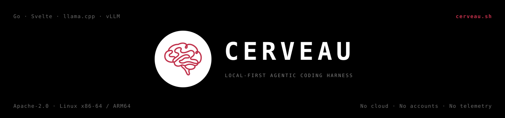

<div align="center">
  

  <p><strong>A local-first agentic coding harness — built from scratch to squeeze every drop out of the hardware you already own.</strong></p>

  <p>
    
    
    
    
    
    
  </p>

  <p>Your models. Your machine. Your memory. No cloud, no accounts, no telemetry.</p>

  <p><a href="https://cerveau.sh"><strong>cerveau.sh</strong></a> · <a href="#quick-start"><strong>Quick start ↓</strong></a></p>
</div>

---

Cerveau is a coding agent designed as a **harness from first principles** — not a
chat UI with tools bolted on. A single Go binary owns the agent loop, the context
window, tool dispatch and structural safety guards; the Svelte control panel is
embedded inside it; the model is just a URL to your local `llama.cpp` server.

It exists for one audience: **people who run models on their own metal** —
homelabs, workstations, small servers — and refuse to let 90 % of their machine
sit idle while a cloud subscription does the thinking.

## Philosophy: the restrictions are the feature

Most agent harnesses are Swiss-army knives — and rightly so, for their goal:
they serve every provider, every model size, every deployment. But generality
has a quiet cost. Machinery built to work with *any* model ends up implicitly
designed around the *strongest* ones, and a small local model inherits
scaffolding that assumes it won't fail — then fails in ways nothing catches.

Cerveau makes the opposite trade. One target: **consumer-grade GPUs and
professional workstations, lots of system RAM, small MoE models.** Because the
target is fixed, every layer gets to assume it — output caps sized to what the
model can actually emit, grammars constraining what it generates, recovery
paths for the exact ways it breaks, a context discipline built for 32K rather
than pretending 200K. Nothing is provider-agnostic, and that's the point.

The result is not a smarter model — it's a harness that **absorbs the failure
modes of modest models**, so a few billion active parameters deliver work that
otherwise needs a much larger one. Specialization is what a general tool
cannot offer; it's the entire reason Cerveau exists.

## Why a harness for local hardware

Most agent frontends assume an infinite, fast, cloud-hosted model. Local reality
is different: your model is quantized, your VRAM is finite, your context window
is precious, and every token has a real cost in seconds. Cerveau is engineered
around exactly those constraints.

### 🧠 The whole machine, not just the GPU

Modern MoE models (Qwen3-A3B, Mixtral-class) are *made* for hybrid hardware:
only a few experts fire per token, so the hot path (attention, KV cache) lives
in VRAM while the bulk expert weights stream from ordinary system RAM.

The reference rig — one RTX 3090 (24 GB) + 16-core CPU + 128 GB DDR5 — runs a
**35B-parameter MoE at 73–107 tok/s with a full 32K context and up to 8K tokens
of output per call**. The same box, with the naive "everything the GPU can't
hold goes to CPU" defaults, ran at **0.9 tok/s**. That gap is pure
configuration, and the split is a *dial*, not a setting:

| Profile | `--n-cpu-moe` | Speed | VRAM left for other models |
|---|---|---|---|
| `shared` | 34 | ~73 tok/s | **~12 GB** — stack a TTS, draft model, image gen |
| `fast` | 16 | ~98 tok/s | ~4 GB |
| `max` | 10 | ~107 tok/s | ~1.4 GB — dedicated benchmark mode |

```bash
llama-server -m model.gguf --host 127.0.0.1 --port 8080 \
  -ngl 99 --n-cpu-moe 34 \    # split experts: hot layers in VRAM, rest in RAM
  -t 16 \                     # PHYSICAL cores — hyperthreads fight for bandwidth
  -c 32768 --cache-type-k q4_0 --cache-type-v q4_0 \
  --no-mmap --jinja
```

The all-in-VRAM configs people benchmark hit 110–140 tok/s — by giving the model
the *entire* GPU and a cramped context. Cerveau's split means your 64–128 GB of
RAM becomes model capacity, and your GPU stays *yours*: the `shared` profile
runs the 35B agent **and** leaves 12 GB for whatever else you stack.

### 📼 A context window treated like the scarce resource it is

Every session is an append-only `events.jsonl` — **memory is the state**, the
window is only a projection of it. Tool outputs are capped at dispatch and age
into event-pointers the model can re-pull on demand; the system prompt stays
KV-cache-stable across turns. On a 32K local context, that discipline is the
difference between an agent that works and one that forgets what it's doing.

### 🔁 Built for small models that make mistakes

A 3B-active local model is not Opus, and Cerveau doesn't pretend it is:

- Failed commands return their **real stdout/stderr** to the model, so it reads
  the actual error and self-corrects (verified: it debugged its own Tailwind v4
  migration).
- Loop detection is **result-aware** — re-running `npm run build` while fixing
  things is progress, not a loop; identical output twice is.
- Truncated tool calls are detected and fed back as "split the write" instead of
  dying — and a poisoned history can never break future turns (replayed calls
  are sanitized).
- The agent knows its **workspace path, its reserved ports, and its model's
  actual modalities** — introspected at runtime, never assumed.

### 🛡️ Safety that is structural, not prompted

A dispatch guard pattern-matches tool *arguments* before execution and catches
the common footguns: `rm -rf /`, force-pushes, `DROP TABLE`, piping a remote
script into a shell. Destructive `mv` is auto-rewritten to copy-verify-delete.
The file tools (`read`/`write`/`edit`) are additionally jailed to the workspace —
lexically *and* through symlinks, enforced in Go, not prompted.

This is a **safety floor, not a sandbox.** The guard is pattern-based: an
obfuscated command can evade it, and `bash` itself is not yet OS-sandboxed (a
Landlock jail is on the roadmap). Treat API access as shell access to your
machine — run Cerveau as an unprivileged user, and see [SECURITY.md](SECURITY.md)
for the full threat model.

### 🧩 Five memory systems, zero ceremony

| Memory | Store | Role |
|---|---|---|
| Working | the live window | what the model sees this turn |
| Episodic | `events.jsonl` | append-only source of truth, crash-safe |
| Semantic | Typesense (managed) | curated cross-session facts, deduped, with provenance |
| Codebase | SQLite graph | symbols + call edges, ~10× cheaper than grep for structure |
| Procedural | `~/.crv/skills/*.md` | markdown skills, loaded on trigger |

Recall is **system-owned**: relevant facts and past events are pulled into every
turn automatically. The agent never has to remember to remember.

## How Cerveau compares

There are excellent tools in this space, and Cerveau borrows no code from any of
them. Where they sit:

- **Chat UIs for local models** (Open WebUI, LM Studio, Jan) — great for
  conversation and RAG; they are not agentic harnesses. No autonomous tool
  loops, no plan execution, no structural guards.
- **IDE / terminal coding agents** (Aider, Cline, Continue) — strong coding
  agents, mostly designed around frontier cloud models, with the local case as
  a fallback.
- **Agent frameworks** (OpenHands, Goose) — powerful and general, typically
  heavier deployments and, again, tuned for models that rarely fail.

Cerveau's niche is narrower and deliberate: **an agent harness engineered
around how small local models actually fail.** Truncated tool calls, poisoned
histories, blind retries, hallucinated paths and ports — the recovery machinery
for those lives in the Go core, because a 3B-active model needs it on every
session. Add the event-sourced memory, the compiled-in safety guard, and the
single-binary deployment, and the result isn't a claim of novelty for its
parts — the loop, the tools, the vector store are all well-trodden ideas —
but of an ecosystem built coherently, from scratch, for one job: making modest
hardware do serious agentic work.

## Requirements

| | |
|---|---|
| **Go** | 1.25+ |
| **Node** | 20+ (build the panel once) |
| **llama.cpp** | a `llama-server` build + a GGUF model |
| **Python** | 3.10+ — optional, only for the embedder sidecar |

**Platform:** Linux (x86-64 / ARM64) today. macOS is close (core + syscalls work; the system monitor and folder picker need platform shims). A **Windows version is planned** — see the roadmap.

> **Security:** Cerveau binds to `127.0.0.1` by default. The API is
> unauthenticated and can run shell commands (autopilot) — do **not**
> expose it to a network without your own auth or tunnel in front.

Typesense is **not** a prerequisite — Cerveau downloads and manages its own
instance on first run, on its own port, without touching any existing install.

## Quick start

```bash
# 1. build the panel (embedded into the binary via go:embed)
cd panel && npm install && npm run build && cd ..

# 2. build the binary
go build -o ~/.local/bin/crv ./cmd/crv

# 3. serve a model (flags above). Reference model — the one all benchmarks
#    in this README were measured on: Qwen3.6-35B-A3B, Q4_K_M quant (~22 GB)
llama-server -m Qwen3.6-35B-A3B-UD-Q4_K_M.gguf --host 127.0.0.1 --port 8080 --jinja

# 4. run
crv
```

Open **http://localhost:7700**. Optionally start hybrid vector recall:

```bash
python3 sidecars/nemotron_embed.py   # OpenAI-compatible /v1/embeddings on :8081
```

> **Reasoning models:** Cerveau sends `enable_thinking: false` on every request —
> otherwise a thinking model burns its whole token budget inside `<think>` and
> returns nothing.

## The three modes

| Mode | Contract |
|---|---|
| **Discussion** | ultra-concise planning; writes limited to design artifacts; crystallizes into a committed plan |
| **Brainstorming** | deep research, web + code tools + memory, findings externalized to notes |
| **Autopilot** | full autonomy end-to-end; re-plans on failure; hands back only when truly blocked |

Live tool cards show the real command and its real output as it runs. Errors
surface as actionable cards with the reason expanded — never a silent spinner,
never a log wall.

## Configuration

Created on first run at `~/.config/cerveau/config.json`:

```json
{
  "addr": ":7700",
  "workspace": "/path/to/your/project",
  "model_ctx": 32768,
  "endpoints": {
    "model":     "http://localhost:8080",
    "embedder":  "http://localhost:8081",
    "typesense": "http://localhost:8189"
  }
}
```

Anything can be overridden via `CRV_*` environment variables. All runtime data
lives under `~/.crv/` — your project directories are never touched except by the
file edits you ask for.

## Architecture

```
  Svelte panel ──HTTP──▶ Go core ──OpenAI API──▶ llama.cpp (your hardware)
   (go:embed)             │
                          ├─▶ events.jsonl        episodic — source of truth
                          ├─▶ Typesense (managed) recall index + semantic facts
                          ├─▶ SQLite code graph   symbols + call edges
                          └─▶ skills/             procedural, plain markdown
```

Tools are declared once in a registry — JSON schema, risk tier, per-mode
availability, ingress cap — and their grammars are generated, never
hand-written. A release is a **single static binary**.

## CLI

```bash
go build -o ~/.local/bin/crvcli ./cmd/crvcli

crvcli ask "explain the window manager"   # one-shot, scriptable
crvcli sessions
crvcli health
```

## Development

```bash
go test ./...               # full Go suite
cd panel && npm run dev     # panel with HMR on :5171, proxying to :7700
```

## Contributing

PRs welcome. Cerveau uses the **[DCO](https://developercertificate.org/)** — no
CLA, no signup, just sign your commits:

```bash
git commit -s -m "your change"
```

See [CONTRIBUTING.md](CONTRIBUTING.md).

## Status

**v0.1 — early, and daily-driven.** Cerveau builds real projects end to end
(scaffold → build → read its own errors → fix), and every number in this README
was measured, not estimated. It is still a young codebase: expect rough edges. Known limitations are
stated where they exist (e.g. per-session tool jailing is not yet enforced for
instant sessions) rather than papered over.

## License

**Apache-2.0** — see [LICENSE](LICENSE) and [NOTICE](NOTICE).

Use it, modify it, fork it, run it commercially — freely. One reservation, per
Apache 2.0 §6: **"Cerveau" is a trademark** of Mounir Belahbib and Shiny Studio
OÜ. Derivative products may not ship under the Cerveau name or branding
(no "Cerveau Pro"). Fork it proudly — under your own name.

---

<div align="center">
  <sub>Built by <a href="https://github.com/ShAInyXYZ">Mounir Belahbib (ShAInyXYZ)</a> · a <a href="https://cerveau.sh">Cerveau</a> project by <a href="https://shinystudio.xyz">Shiny Studio OÜ</a></sub>
</div>
